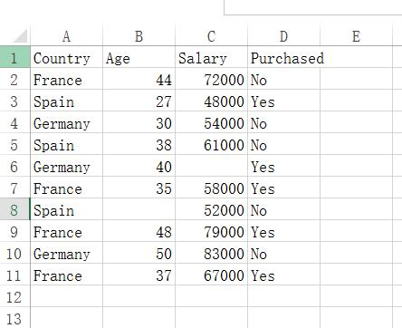

# data preprocessing 数据预处理

首先，导入必备的数据处理库：

```python
import numpy as np
from matplotlib import pyplot as plt
import pandas as pd
```

----

然后，导入数据集(是否购买某产品)：

其中，iloc为根据索引定位来获取指定的数据，[]中第一个参数为行号，第二个参数为列号。

```python
dataset = pd.read_csv('Data.csv')
X = dataset.iloc[:,:-1].values
y = dataset.iloc[:,3].values
```

数据集内容如下图，包括4个特征，国家，年龄，薪水，是否购买了该产品。

X为除了最后一列的所有数据，y为最后一列(即第3列，因为索引从0开始算)。




---

可以看出来，Age和Salary中都有missing data，所以需要将其补全。

补全连续特征的缺失值，通常可以使用均值和中位数，也可以使用众数或通过其他特征来进行回归预测。而补全离散特征的缺失值可以用众数或利用其他特征来预测补全。

```python
from sklearn.preprocessing import Imputer
imputer = Imputer(missing_values = 'NaN', strategy = 'mean', axis = 0)
imputer = imputer.fit(X[:, 1:3])
X[:, 1:3] = imputer.transform(X[:, 1:3])
```


其中Imputer为填补缺失值的类，主要参数说明：

> missing_values:缺失值，可以为整数或者NaN((缺失值numpy.nan用字符串‘NaN’表示)
>
> strategy：替换策略，字符串，默认用均值‘mean’替换
>
> > ①若为mean时，用特征列的均值替换
> >
> > ②若为median时，用特征列的中位数替换
> >
> > ③若为most_frequent时，用特征列的众数替换
>
> axis：指定轴数，默认axis=0代表列，axis=1代表行

可以把Imputer当成一个模型，首先要imputer.fit(X[:,需要补全的列])，将模型训练出来

然后利用fit好的模型，执行：X[:,需要补全的列] = imputer..transform(X[:,需要补全的列])

将其变换。

---

由于国家是分类特征，且是无顺序的，所以要将其转换为分类特征，即dummy variable

而target转换为0,1

```python
from sklearn.preprocessing import LabelEncoder, OneHotEncoder
labelencoder_X = LabelEncoder()
X[:, 0] = labelencoder_X.fit_transform(X[:, 0])
onehotencoder = OneHotEncoder(categorical_features = [0])
X = onehotencoder.fit_transform(X).toarray()

labelencoder_y = LabelEncoder()
y = labelencoder_y.fit_transform(y)
```

---

最后，将数据集分为训练集与测试集

```python
# Splitting the dataset into the Training set and Test set
from sklearn.cross_validation import train_test_split
X_train, X_test, y_train, y_test = train_test_split(X, y, test_size = 0.2, random_state = 0)
```

---

---

全部代码:

```python
# Data Preprocessing

# Importing the libraries
import numpy as np
import matplotlib.pyplot as plt
import pandas as pd

# Importing the dataset
dataset = pd.read_csv('Data.csv')
X = dataset.iloc[:, :-1].values
y = dataset.iloc[:, 3].values

# Taking care of missing data
from sklearn.preprocessing import Imputer
imputer = Imputer(missing_values = 'NaN', strategy = 'mean', axis = 0)
imputer = imputer.fit(X[:, 1:3])
X[:, 1:3] = imputer.transform(X[:, 1:3])

#Take care of missing data
from sklearn.preprocessing import Imputer
imputer = Imputer(missing_values="NaN", strategy="mean", axis=0, verbose=1)
imputer = imputer.fit(X[:,1:3])
X[:,1:3] = imputer.transform(X[:,1:3])

#Encode categorical data
#labelEncoder
from sklearn.preprocessing import LabelEncoder, OneHotEncoder
labelencoder_X = LabelEncoder()
X[:, 0] = labelencoder_X.fit_transform(X[:, 0])
onehotencoder = OneHotEncoder(categorical_features = [0])
X = onehotencoder.fit_transform(X).toarray()
# Encoding the Dependent Variable
labelencoder_y = LabelEncoder()
y = labelencoder_y.fit_transform(y)

# Splitting the dataset into the Training set and Test set
from sklearn.cross_validation import train_test_split
X_train, X_test, y_train, y_test = train_test_split(X, y, test_size = 0.2, random_state = 0)

```


代码github地址：[data_preprocessing_template.py](https://github.com/ElijahMingLiu/ml-learn/blob/master/ml001/01_data_preprocessing/resources/data_preprocessing_template.py)

