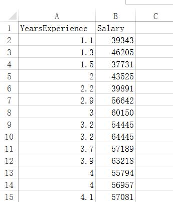

# simple linear regression 简单线性回归

此次，数据集为根据工作经验来预测年薪

首先导入数据，并进行数据预处理

```python
#Import the library
import numpy as np
from matplotlib import pyplot as plt
import pandas as pd

#Importing the dataset
dataset = pd.read_csv('Salary_Data.csv')
X = dataset.iloc[:,:-1].values
y = dataset.iloc[:,1].values

#Splitting the dataset into the Training set and Test set
from sklearn.cross_validation import train_test_split
X_train, X_test, y_train, y_test = train_test_split(X,y, test_size=1/3, random_state=0 )
```

其中，数据集形式如下，只有一个特征，即工作年薪，而目标则是年薪。

其中共30个数据，所以将数据分为20个训练数据，10个测试数据



然后，利用训练数据训练出模型，并在测试集上进行预测

```python
#Fitting Simple Linear Regression to the Training set
from sklearn.linear_model import LinearRegression
regressor = LinearRegression()
regressor.fit(X_train,y_train)

#Predicting the Test set results
y_pred = regressor.predict(X_test)
```

---


可视化训练集上的效果：

首先，使用scatter把点显示上去

```python
plt.scatter(X_train,y_train,color='red')
```

然后，使用plot显示出预测的线

```python
plt.plot(X_train,regressor.predict(X_train),color='blue')

```

最后，加上标题及x轴y轴信息，并显示

```python
plt.title('Salary vs Experience (Training set)')
plt.xlabel('Years of Experience')
plt.ylabel('Salary')
plt.show()
```


可视化在测试集上的预测效果，注意：plot出的线是训练集上的线，因为是根据训练集上训练出来的线来预测测试集的，所以预测线应该是在训练集上预测出来的线

```python
#Visualizing the Test set results
plt.scatter(X_test,y_test,color='red')
plt.plot(X_train,regressor.predict(X_train),color='blue')#the line is based on training set so we don't have to replace this by test set
plt.title('Salary vs Experience (Test set)')
plt.xlabel('Years of Experience')
plt.ylabel('Salary')
plt.show()
```


---

---

全部代码:

```python
#Data Preprocessing

#Import the library
import numpy as np
from matplotlib import pyplot as plt
import pandas as pd

#Importing the dataset
dataset = pd.read_csv('Salary_Data.csv')
# iloc is the class by using which can slice the dataset in which the first is rows and second is columns
X = dataset.iloc[:,:-1].values
y = dataset.iloc[:,1].values

#Splitting the dataset into the Training set and Test set
from sklearn.cross_validation import train_test_split
X_train, X_test, y_train, y_test = train_test_split(X,y, test_size=1/3, random_state=0 )

#Fitting Simple Linear Regression to the Training set
from sklearn.linear_model import LinearRegression
regressor = LinearRegression()
regressor.fit(X_train,y_train)

#Predicting the Test set results
y_pred = regressor.predict(X_test)

#Visualizing the Training set results
plt.scatter(X_train,y_train,color='red')
plt.plot(X_train,regressor.predict(X_train),color='blue')
plt.title('Salary vs Experience (Training set)')
plt.xlabel('Years of Experience')
plt.ylabel('Salary')
plt.show()

#Visualizing the Test set results
plt.scatter(X_test,y_test,color='red')
plt.plot(X_train,regressor.predict(X_train),color='blue')#the line is based on training set so we don't have to replace this by test set
plt.title('Salary vs Experience (Test set)')
plt.xlabel('Years of Experience')
plt.ylabel('Salary')
plt.show()
```


代码github地址：[simple_linear_regression.py](../resources/simple_linear_regression.py)

