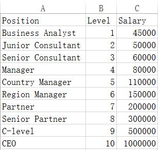
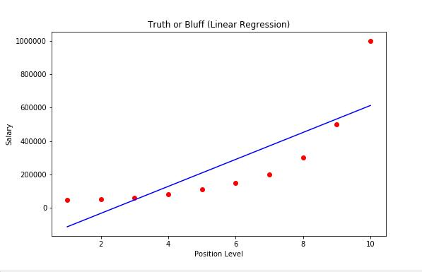
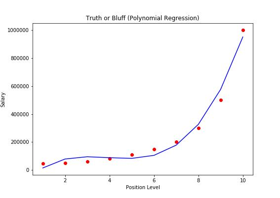
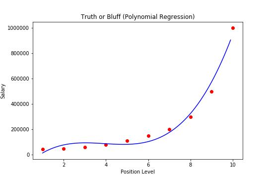

#Polynomial Regression 多项式回归


### 数据预处理

一个公司要雇佣某个人，希望根据其之前的职位与等级，确定其月薪。下面的数据集为其资料，2个特征Position(岗位)，Level(等级)，而目标为Salary(月薪)。



由于第一个特征:Position的每一个值都不同，而且不是有序的，对于预测没有意义。因此，不使用其进行预测，仅使用Level进行预测。

而且，由于使用这个数据集的意义，是为了确定某个人的工资，不适合切分为训练集与数据集，所以使用所有数据对其进行拟合。

```python
# Importing the libraries
import numpy as np
import matplotlib.pyplot as plt
import pandas as pd

# Importing the dataset
dataset = pd.read_csv('Position_Salaries.csv')
X = dataset.iloc[:, 1:2].values
y = dataset.iloc[:, 2].values
```


### 简单线性回归

```python
from sklearn.linear_model import LinearRegression
lin_reg = LinearRegression()
lin_reg.fit(X, y)
```

### 多项式回归

首先，使用**sklearn.preprocessing.PolynomialFeatures** 变换特征，如：最初的特征为$x_1$ ，则变换后的特征为：$1,x_1,x_1^2,x_1^3,x_1^4，x_1^5$...，其中1为截距项，变换后自动产生。

```python
from sklearn.preprocessing import PolynomialFeatures
poly_reg = PolynomialFeatures(degree=3)
X_poly = poly_reg.fit_transform(X)
```

之后，使用线性回归器对**多项式后的数据集**进行拟合：

```python
lin_reg_2 = LinearRegression()
lin_reg_2.fit(X_poly, y)
```

###数据可视化

接下来，使用可视化查看下拟合的效果，首先，查看线性回归的效果

```python
plt.scatter(X, y, color='red')
plt.plot(X, lin_reg.predict(X), color='blue')
plt.title('Truth or Bluff (Linear Regression)')
plt.xlabel('Position Level')
plt.ylabel('Salary')
plt.show()
```



可以看出来，效果并不理想。


再看看多项式分类器如何：

```python
plt.scatter(X, y, color='red')
plt.plot(X, lin_reg_2.predict(poly_reg.fit_transform(X)), color='blue')
plt.title('Truth or Bluff (Polynomial Regression)')
plt.xlabel('Position Level')
plt.ylabel('Salary')
plt.show()
```



由于数据点并不密集，所以预测线有点粗糙，那么将数据点密集化，然后再查看预测的效果如何。

> 使用*numpy.arange(a,b,interval)* 可以获得范围为[a, b)的有序数列，他们的距离为interval，如：
>
> <font color=00BFFF>In [13]: np.arange(1,  2,  0.1)</font>
>
> <font color=00BFFF>Out[13]: array([ 1. ,  1.1,  1.2,  1.3,  1.4,  1.5,  1.6,  1.7,  1.8,  1.9])</font>

```python
X_grid = np.arange(min(X), max(X), 0.1)
X_grid = X_grid.reshape(len(X_grid), 1)
plt.scatter(X, y, color='red')
plt.plot(X_grid, lin_reg_2.predict(poly_reg.fit_transform(X_grid)), color='blue')
plt.title('Truth or Bluff (Polynomial Regression)')
plt.xlabel('Position Level')
plt.ylabel('Salary')
plt.show()
```



接下来，可以尝试下预测，分别使用线性回归与多项式回归对Level为6.5进行测试

```python
#Prediction a new result with Linear Regression
lin_reg.predict(6.5)

#Prediction a new result with Polynomial Regression
lin_reg_2.predict(poly_reg.fit_transform(6.5))
```

<font color=00BFFF>In [13]: lin_reg.predict(6.5)</font>

<font color=00BFFF>Out[15]: array([ 330378.78787879])</font>

<font color=00BFFF>In [13]: lin_reg_2.predict(poly_reg.fit_transform(6.5))</font>

<font color=00BFFF>Out[16]: array([ 133259.46969697])</font>

根据上面的图片来分析，还是多项式预测的结果比较符合逻辑。

---

---

全部代码:

```python
#Polynomial Regression
# Data Preprocessing

# Importing the libraries
import numpy as np
import matplotlib.pyplot as plt
import pandas as pd

# Importing the dataset
dataset = pd.read_csv('Position_Salaries.csv')
X = dataset.iloc[:, 1:2].values
y = dataset.iloc[:, 2].values

#Fitting Linear Regression to the dataset
from sklearn.linear_model import LinearRegression
lin_reg = LinearRegression()
lin_reg.fit(X, y)

#Fitting Polynomial Regression to the dataset
from sklearn.preprocessing import PolynomialFeatures
poly_reg = PolynomialFeatures(degree=3)
X_poly = poly_reg.fit_transform(X)
lin_reg_2 = LinearRegression()
lin_reg_2.fit(X_poly, y)

# Visualizing the Linear Regression results
plt.scatter(X, y, color='red')
plt.plot(X, lin_reg.predict(X), color='blue')
plt.title('Truth or Bluff (Linear Regression)')
plt.xlabel('Position Level')
plt.ylabel('Salary')
plt.show()

#Visualizing the Polynomial Regression results
X_grid = np.arange(min(X), max(X), 0.1)
X_grid = X_grid.reshape(len(X_grid), 1)
plt.scatter(X, y, color='red')
plt.plot(X_grid, lin_reg_2.predict(poly_reg.fit_transform(X_grid)), color='blue')
plt.title('Truth or Bluff (Polynomial Regression)')
plt.xlabel('Position Level')
plt.ylabel('Salary')
plt.show()

#Prediction a new result with Linear Regression
lin_reg.predict(6.5)

#Prediction a new result with Polynomial Regression
lin_reg_2.predict(poly_reg.fit_transform(6.5))
```


代码github地址：[polynomial_regression.py](../resources/polynomial_regression.py)

