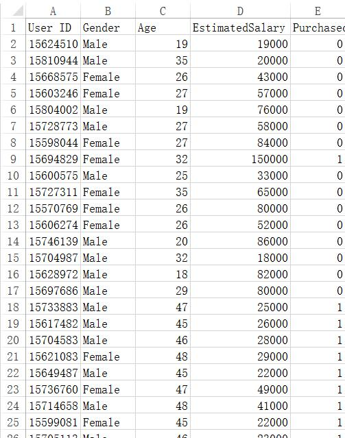

# Logistic Regression 逻辑斯蒂回归


###预处理

导入必要的工具包

```python
import numpy as np
import matplotlib.pyplot as plt
import pandas as pd
```

---

导入数据集，其中数据集信息如下:

数据集为某汽车公司的某款SUV用户数据集。

**特征**包括：

> User ID:用户ID
>
> Gender:性别
>
> Age:年纪
>
> EstimatedSalary:预估的薪水

**预测目标**为

> Purchased:是否购买了该SUV。

由于本例使用**Logistic Regression**进行预测，只能使用连续值特征，所以**分类数据(性别)**无法使用。而且，用户ID是随机生成的，**与是否购买SUV无关**，所以不使用**User ID**与**Gender**进行预测，只使用第2,3列(**Age**和**EstimatedSalary**)。



---

```python
# Importing the dataset
dataset = pd.read_csv('Social_Network_Ads.csv')
X = dataset.iloc[:, [2, 3]].values
y = dataset.iloc[:, 4].values

# Splitting the dataset into the Training set and Test set
from sklearn.cross_validation import train_test_split
X_train, X_test, y_train, y_test = train_test_split(X, y, test_size = 0.25, random_state = 0)
```

---

###训练与预测

使用Logistic Regression最好先regularization:

```python
from sklearn.preprocessing import StandardScaler
sc = StandardScaler()
X_train = sc.fit_transform(X_train)
X_test = sc.transform(X_test)
```

---

使用Logistic Regression拟合训练集:

```python
from sklearn.linear_model import LogisticRegression
classifier = LogisticRegression(random_state = 0)
classifier.fit(X_train, y_train)
```

---

对测试集进行预测:

```python
y_pred = classifier.predict(X_test)
```

---

创造混淆矩阵(Confusion Matrix)

```python
from sklearn.metrics import confusion_matrix
cm = confusion_matrix(y_test, y_pred)
```

二元混淆矩阵结构如下：

| Total Population      | Condition positive | Condition negative |
| --------------------- | :----------------: | -----------------: |
| Test outcome positive |   True positive    |     False positive |
| Test outcome negative |   False negative   |      True negative |

---

###可视化

对训练集进行可视化：

```python
from matplotlib.colors import ListedColormap
X_set, y_set = X_train, y_train
X1, X2 = np.meshgrid(np.arange(start = X_set[:, 0].min() - 1, stop = X_set[:, 0].max() + 1, step = 0.01),
                     np.arange(start = X_set[:, 1].min() - 1, stop = X_set[:, 1].max() + 1, step = 0.01))
plt.contourf(X1, X2, classifier.predict(np.array([X1.ravel(), X2.ravel()]).T).reshape(X1.shape),
             alpha = 0.75, cmap = ListedColormap(('red', 'green')))
plt.xlim(X1.min(), X1.max())
plt.ylim(X2.min(), X2.max())
for i, j in enumerate(np.unique(y_set)):
    plt.scatter(X_set[y_set == j, 0], X_set[y_set == j, 1],
                c = ListedColormap(('red', 'green'))(i), label = j)
plt.title('Logistic Regression (Training set)')
plt.xlabel('Age')
plt.ylabel('Estimated Salary')
plt.legend()
plt.show()
```

效果如下：


下面来具体讲解可视化代码：

首先，导入ListedColormap，用于上色

```python
from matplotlib.colors import ListedColormap
```

然后，将训练集作为显示的set(为了可视化测试集时,复制后修改少量代码即可)

```python
X_set, y_set = X_train, y_train
```

可视化的两个坐标分别是Age与EstimatedSalary。

由于要把背景分为浅红与浅绿色，要对每个点进行预测后，将其上色。

所以**np.meshgrid**用来生成Age与EstimatedSalary的笛卡尔积，比如a=[1, 2, 3],b=[4, 5, 6]，那么使用meshgrid后，结果如下：


本例设置arange的step=0.01，是为了预测更加密集。

```python
X1, X2 = np.meshgrid(np.arange(start = X_set[:, 0].min() - 1, stop = X_set[:, 0].max() + 1, step = 0.01),
                     np.arange(start = X_set[:, 1].min() - 1, stop = X_set[:, 1].max() + 1, step = 0.01))
```

---

接下来，使用contourf进行上色:

**contourf(X1, X2,...**中X1，X2组成了笛卡尔积。

**np.array([X1.ravel(), X2.ravel()]).T**是先将X1,X2转换为向量，然后组合在一起形成2行400列的矩阵，然后转置变成400行2列的矩阵，这样就可以使用**classifier.predict**进行预测。

将X1与X2组合成为2行400列的矩阵，并转置为400行2列，与数据集的格式相同，以便进行预测。

contourf的参数如下:

> X1:横坐标点
>
> X2：纵坐标点
>
> f(X1,X2):上色的结果，这里是classifier.predict...，其值类似[0,1,0,0,1,0,1,1....]，对应于下面的cmap
>
> alpha:上色色彩的深度
>
> cmap:值为ListedColormap，对应于f(X1,X2)的值，类似一个字典，决定了上什么颜色。


```python
plt.contourf(X1, X2, classifier.predict(np.array([X1.ravel(), X2.ravel()]).T).reshape(X1.shape),
             alpha = 0.25, cmap = ListedColormap(('red', 'green')))
```

---

接下来，画每个点:

```python
for i, j in enumerate(np.unique(y_set)):
    plt.scatter(X_set[y_set == j, 0], X_set[y_set == j, 1],
                c = ListedColormap(('red', 'green'))(i), label = j)
```

for循环共两轮，一次是y_set=0,一次是y_set=1，c是颜色，直接通过ListedColormap映射成红色与绿色，label用于在使用legend后在右上角显示其值。

---

显示其他的内容

```python
plt.title('Logistic Regression (Training set)')
plt.xlabel('Age')
plt.ylabel('Estimated Salary')
plt.legend()
plt.show()
```

---

接下来，可视化测试集，就不上图了。

```python
from matplotlib.colors import ListedColormap
X_set, y_set = X_test, y_test
X1, X2 = np.meshgrid(np.arange(start = X_set[:, 0].min() - 1, stop = X_set[:, 0].max() + 1, step = 0.01),
                     np.arange(start = X_set[:, 1].min() - 1, stop = X_set[:, 1].max() + 1, step = 0.01))
plt.contourf(X1, X2, classifier.predict(np.array([X1.ravel(), X2.ravel()]).T).reshape(X1.shape),
             alpha = 0.25, cmap = ListedColormap(('red', 'green')))
plt.xlim(X1.min(), X1.max())
plt.ylim(X2.min(), X2.max())
for i, j in enumerate(np.unique(y_set)):
    plt.scatter(X_set[y_set == j, 0], X_set[y_set == j, 1],
                c = ListedColormap(('red', 'green'))(i), label = j)
plt.title('Logistic Regression (Test set)')
plt.xlabel('Age')
plt.ylabel('Estimated Salary')
plt.legend()
plt.show()
```


---

---

全部代码:

```python
# Logistic Regression

# Importing the libraries
import numpy as np
import matplotlib.pyplot as plt
import pandas as pd

# Importing the dataset
dataset = pd.read_csv('Social_Network_Ads.csv')
X = dataset.iloc[:, [2, 3]].values
y = dataset.iloc[:, 4].values

# Splitting the dataset into the Training set and Test set
from sklearn.cross_validation import train_test_split
X_train, X_test, y_train, y_test = train_test_split(X, y, test_size = 0.25, random_state = 0)

# Feature Scaling
from sklearn.preprocessing import StandardScaler
sc = StandardScaler()
X_train = sc.fit_transform(X_train)
X_test = sc.transform(X_test)

# Fitting Logistic Regression to the Training set
from sklearn.linear_model import LogisticRegression
classifier = LogisticRegression(random_state = 0)
classifier.fit(X_train, y_train)

# Predicting the Test set results
y_pred = classifier.predict(X_test)

# Making the Confusion Matrix
from sklearn.metrics import confusion_matrix
cm = confusion_matrix(y_test, y_pred)

# Visualising the Training set results
from matplotlib.colors import ListedColormap
X_set, y_set = X_train, y_train
X1, X2 = np.meshgrid(np.arange(start = X_set[:, 0].min() - 1, stop = X_set[:, 0].max() + 1, step = 0.01),
                     np.arange(start = X_set[:, 1].min() - 1, stop = X_set[:, 1].max() + 1, step = 0.01))
plt.contourf(X1, X2, classifier.predict(np.array([X1.ravel(), X2.ravel()]).T).reshape(X1.shape),
             alpha = 0.75, cmap = ListedColormap(('red', 'green')))
plt.xlim(X1.min(), X1.max())
plt.ylim(X2.min(), X2.max())
for i, j in enumerate(np.unique(y_set)):
    plt.scatter(X_set[y_set == j, 0], X_set[y_set == j, 1],
                c = ListedColormap(('red', 'green'))(i), label = j)
plt.title('Logistic Regression (Training set)')
plt.xlabel('Age')
plt.ylabel('Estimated Salary')
plt.legend()
plt.show()

# Visualising the Test set results
from matplotlib.colors import ListedColormap
X_set, y_set = X_test, y_test
X1, X2 = np.meshgrid(np.arange(start = X_set[:, 0].min() - 1, stop = X_set[:, 0].max() + 1, step = 0.01),
                     np.arange(start = X_set[:, 1].min() - 1, stop = X_set[:, 1].max() + 1, step = 0.01))
plt.contourf(X1, X2, classifier.predict(np.array([X1.ravel(), X2.ravel()]).T).reshape(X1.shape),
             alpha = 0.75, cmap = ListedColormap(('red', 'green')))
plt.xlim(X1.min(), X1.max())
plt.ylim(X2.min(), X2.max())
for i, j in enumerate(np.unique(y_set)):
    plt.scatter(X_set[y_set == j, 0], X_set[y_set == j, 1],
                c = ListedColormap(('red', 'green'))(i), label = j)
plt.title('Logistic Regression (Test set)')
plt.xlabel('Age')
plt.ylabel('Estimated Salary')
plt.legend()
plt.show()
```


代码github地址：[logistic_regression.py](../resources/logistic_regression.py)

